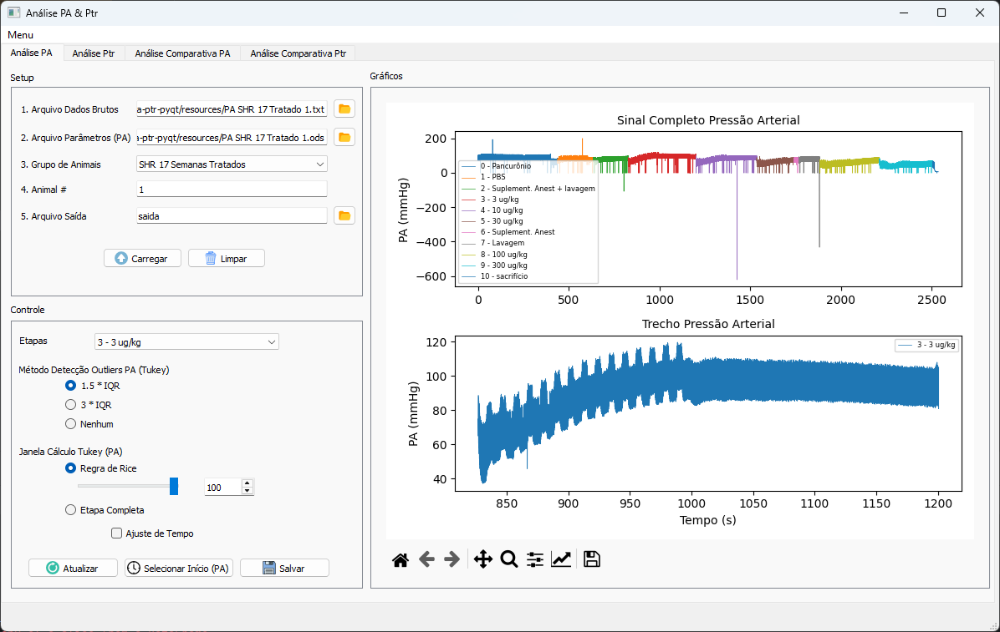

# pa-ptr-pyqt

## Código fonte do Software para análise de pressões arterial e traqueal
## _Source code for Arterial and Tracheal pressure analysis software_
\


Software desenvolvido como parte da dissertação de mestrado na Escola Politécnica da Universidade de São Paulo\
_Software developed as part of a Master's Degree project (Escola Politécnica / University of São Paulo)_

O vídeo tutorial para utilização está disponível no link abaixo:\
_Video tutorial available on:_\
https://youtu.be/EnC2EJzrk_8

\
Para rodar o código, é necessário instalar as dependências listadas:\
_To run properly, please install the required dependencies:_
```
pip install -r requirements.txt
```
\
O executável standalone pode ser criado através do comando (py2exe):\
_The standalone executable can be created using the prompt below (py2exe):_
```
python setup.py py2exe
```
\
Mais informações nos links abaixo:\
_More information available on:_\
https://doi.org/10.11606/D.3.2023.tde-22052023-153615 \
https://doi.org/10.1007/978-3-030-70601-2_10
